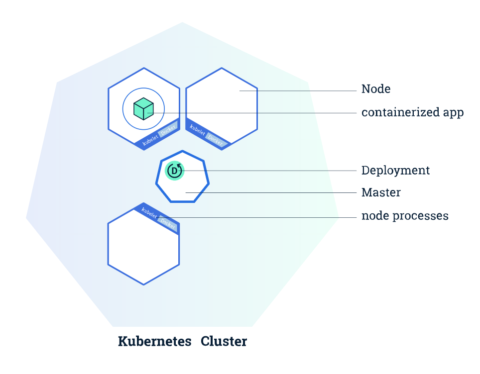

# haiku-scalable-example
Scalable reinforcement learning agents on container orchestration

[](<https://circleci.com/gh/chris-chris/haiku-scalable-example>)
[](https://coveralls.io/github/chris-chris/haiku-scalable-example?branch=master)

## 1. Purpose of the project
Implement scalable reinforcement learning agent on the container orchestraion system like k8s.

## 2. Container Orchestraion
- [x] Kubernetes
- [ ] Slurm
- [ ] Google Cloud Platform

## 3. Reinforcement Learning Algorithms
- [x] IMPALA
- [ ] A3C
- [ ] TBD

## 4. Architecture

This example will introduce a clear way to deploy scalable reinforcement learning agents to the computing clusters.



## 5. Install

```$bash
$ git clone https://github.com/chris-chris/haiku-scalable-example
$ cd haiku-scalable-example
$ pip install -r requirements.txt
```

## 6. Execute

#### v1. Learner + Multi Actor IMPALA wiring through gRPC.

```$bash
$ python learner_server.py
```

```$bash
$ GRPC_HOST=localhost:50051 python actor_client.py &
$ GRPC_HOST=localhost:50051 python actor_client.py &
```

#### v2. 1 Learner + Multi Actor IMPALA wiring through gRPC on docker VMs.

prepare
```bash
$ docker pull chrisai/haiku-scalable-example-learner:test
$ docker pull chrisai/haiku-scalable-example-actor:test

$ docker network create --subnet 172.20.0.0/16 --ip-range 172.20.240.0/20 multi-host-network
```

run
```bash
$ docker run -d -p 127.0.0.1:50051:50051 --network=multi-host-network --ip=172.20.240.1 chrisai/haiku-scalable-example-learner:test
$ docker run -d --env GRPC_HOST=172.20.240.1:50051 --network=multi-host-network chrisai/haiku-scalable-example-actor:test
```

wanna see logs?
```bash
$ docker ps
$ docker attach [CONTAINER ID]
```

#### v3. 1 Learner + Multi Actor IMPALA wiring through gRPC on k8s.

- Install minikube

https://kubernetes.io/docs/tasks/tools/install-minikube/

- Run
```bash
$ kubectl apply -f impala.yml
```

- Wanna see logs?
```bash
$ kubectl logs -f impala learner
$ kubectl logs -f impala actor
```

## 7. To-dos

- [x] v1. 1 Learner + Multi Actor IMPALA wiring through gRPC.
- [x] v2. 1 Learner + Multi Actor IMPALA wiring through gRPC on docker VMs.
- [x] v3. 1 Learner + Multi Actor IMPALA wiring through gRPC on k8s.
- [x] Optimize the model weight serialization for the performance.
- [ ] v4. Multi Learner + Multi Actor IMPALA wiring through gRPC on k8s.
- [ ] Implement other distributed RL algorithms
- [ ] Asynchronous Processing via Queue
- [ ] Monitor the computing resource usages 

## 8. Reference

I used Deepmind's open sources [haiku](https://github.com/deepmind/dm-haiku), [rlax](https://github.com/deepmind/rlax), and google [jax](https://github.com/google/jax)

- https://github.com/google/jax
- https://github.com/deepmind/rlax
- https://github.com/deepmind/haiku
- https://github.com/kubernetes/kubernetes
- https://github.com/kent-williams/grpc-python-kubernetes
